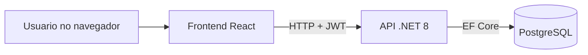

# Sistema de Agendamento Web

Aplicação web para gestão de usuários, agendamentos, disponibilidade de agenda e relatórios, com autenticação JWT, controle por perfil e execução em containers Docker.

## Visão Geral

O projeto foi construído com foco em separação de responsabilidades, regras de negócio explícitas e facilidade de execução local. A solução inclui:

- Backend em .NET 8 com Clean Architecture
- Frontend em React + TypeScript + Vite
- PostgreSQL como banco de dados
- Autenticação JWT com perfis Administrador, Atendente e Cliente
- Relatórios com filtros, ordenação, paginação e exportação CSV/XLSX
- Execução via Docker Compose

## Funcionalidades

- Cadastro, edição, listagem e exclusão de usuários com regras por perfil
- Criação e acompanhamento de agendamentos com validações de conflito e disponibilidade
- Gestão de disponibilidade semanal por atendente
- Consulta de horários disponíveis por atendente e data
- Relatórios com múltiplos tipos e filtros por cliente, atendente, período, tipo e status
- Exportação de relatórios em CSV e XLSX

## Stack Tecnológica

- Backend: .NET 8, ASP.NET Core Minimal API, Entity Framework Core
- Frontend: React, TypeScript, Vite, Axios, Zustand
- Banco: PostgreSQL 16
- Autenticação: JWT Bearer
- Testes: xUnit, Jest, Playwright
- Containers: Docker, Docker Compose

## Arquitetura



## Estrutura do Projeto

- [backend](backend): API, domínio, aplicação, infraestrutura e testes
- [frontend](frontend): aplicação React + TypeScript
- [docs](docs): documentação técnica e checklist de UX
- [docker-compose.yml](docker-compose.yml): stack monolítica
- [docker-compose.microservices.yml](docker-compose.microservices.yml): stack de microsserviços
- [PLAN.md](PLAN.md): plano, checklist e rastreabilidade dos requisitos

## Como Executar com Docker

Pré-requisito: Docker Desktop com Compose habilitado.

Subir a stack principal:

```bash
docker compose -f docker-compose.yml up -d --build
```

Se estiver em outra pasta no terminal, use o caminho absoluto:

```bash
docker compose -f c:\Projetos\agendamentos\docker-compose.yml up -d --build
```

Verificar os containers:

```bash
docker ps
```

Parar a stack:

```bash
docker compose -f docker-compose.yml down
```

Se houver problema de estado órfão no Compose:

```bash
docker compose -f docker-compose.yml down --remove-orphans
docker compose -f docker-compose.yml up -d --build
```

## Endereços Locais

- Frontend: http://localhost:5173
- Backend API: http://localhost:5000
- Swagger: http://localhost:5000/swagger
- PostgreSQL da stack: localhost:5433

## Usuários de Teste

- Administrador: `admin@admin.com` / `Admin123!`
- Atendente: `atendente@atendente.com` / `Atendente123!`
- Cliente: `user@user.com` / `User123!`

## Regras Importantes

- Apenas administrador acessa o módulo de disponibilidade
- Administrador e atendente acessam relatórios
- Cliente cria agendamentos
- Horários de agendamento respeitam disponibilidade e conflitos existentes

## Testes

### Backend

```bash
cd backend
dotnet test Tests/Tests.csproj
```

### Frontend

```bash
cd frontend
npm test
```

### E2E

```bash
cd frontend
npm run test:e2e
```

## Documentação

- [docs/TECHNICAL_DOCUMENTATION.md](docs/TECHNICAL_DOCUMENTATION.md)
- [docs/UX_RESPONSIVE_CHECKLIST.md](docs/UX_RESPONSIVE_CHECKLIST.md)
- [PLAN.md](PLAN.md)

## Microsserviços

O repositório também inclui uma versão baseada em microsserviços.

Subir a arquitetura de microsserviços:

```bash
docker compose -f docker-compose.microservices.yml up -d --build
```

Consulte a documentação específica em:

- [backend/microservices/MICROSERVICES_ARCHITECTURE.md](backend/microservices/MICROSERVICES_ARCHITECTURE.md)
- [backend/microservices/README.md](backend/microservices/README.md)

## Publicação

Se for publicar este projeto no GitHub, este README já está pronto como página principal do repositório.
