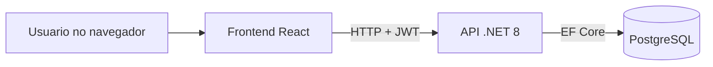

# Sistema de Agendamento Web

Aplicação web para gestão de usuários, agendamentos, disponibilidade de agenda e relatórios, com autenticação JWT, controle por perfil e execução em containers Docker.

Em ambiente de desenvolvimento, o backend aplica as migrations e recria automaticamente a base demo no startup. Isso vale tanto para execução local quanto para Docker usando a configuração padrão de desenvolvimento.

## Visão Geral

O projeto foi construído com foco em separação de responsabilidades, regras de negócio explícitas e facilidade de execução local. A solução inclui:

- Backend em .NET 8 com Clean Architecture
- Frontend em React + TypeScript + Vite
- PostgreSQL como banco de dados
- Autenticação JWT com perfis Administrador, Atendente e Cliente
- Relatórios com filtros, ordenação, paginação e exportação CSV/XLSX
- Execução via Docker Compose

## Funcionalidades

- Cadastro, edição, listagem e exclusão de usuários com regras por perfil
- Criação e acompanhamento de agendamentos com validações de conflito e disponibilidade
- Gestão de disponibilidade semanal por atendente
- Consulta de horários disponíveis por atendente e data
- Relatórios com múltiplos tipos e filtros por cliente, atendente, período, tipo e status
- Exportação de relatórios em CSV e XLSX

## Stack Tecnológica

- Backend: .NET 8, ASP.NET Core Minimal API, Entity Framework Core
- Frontend: React, TypeScript, Vite, Axios, Zustand
- Banco: PostgreSQL 16
- Autenticação: JWT Bearer
- Testes: xUnit, Jest, Playwright
- Containers: Docker, Docker Compose

## Arquitetura



## Estrutura do Projeto

- [backend](backend): API, domínio, aplicação, infraestrutura e testes
- [frontend](frontend): aplicação React + TypeScript
- [docs](docs): documentação técnica e checklist de UX
- [docker-compose.yml](docker-compose.yml): stack monolítica
- [docker-compose.microservices.yml](docker-compose.microservices.yml): stack de microsserviços
- [PLAN.md](PLAN.md): plano, checklist e rastreabilidade dos requisitos

## Comandos Rápidos

### Docker monolito (frontend + backend + banco)

```bash
docker compose -f docker-compose.yml up -d --build
```

Comportamento esperado ao clonar o repositório e subir a stack monolítica:

- o PostgreSQL sobe vazio em um volume local novo
- o backend aplica as migrations automaticamente
- o backend recria os dados demo no startup
- o frontend já abre apontando para a API local

Credenciais demo principais:

- Admin: `admin@admin.com` / `teste@123`
- Atendente: `atendente@atendente.com` / `Atendente123!`
- Cliente: `user@user.com` / `User123!`

Portas (Docker monolito):

- Frontend: http://localhost:5143
- Backend API: http://localhost:5000
- Swagger: http://localhost:5000/swagger
- PostgreSQL: localhost:5433

### Docker microsserviços (gateway + serviços + banco)

```bash
docker compose -f docker-compose.microservices.yml up -d --build
```

Portas principais (Docker microsserviços):

- API Gateway: http://localhost:8080
- Swagger Gateway: http://localhost:8080/swagger
- Frontend local recomendado: http://localhost:5143
- PostgreSQL: localhost:5432

Se aparecer warning de `orphan containers`, rode:

```bash
docker compose -f docker-compose.yml down --remove-orphans
docker compose -f docker-compose.microservices.yml down --remove-orphans
```

### Local sem Docker (resumo)

Backend:

```powershell
cd backend/API
$env:ASPNETCORE_ENVIRONMENT="Development"
$env:ASPNETCORE_URLS="http://localhost:5000"
$env:ConnectionStrings__DefaultConnection="Host=localhost;Port=5433;Database=agendamentos;Username=postgres;Password=postgres"
dotnet run
```

Observação sobre dados demo em execução local:

- com `ASPNETCORE_ENVIRONMENT=Development`, o backend recria automaticamente os dados demo ao iniciar
- isso garante que quem baixar o projeto veja a base populada mesmo em banco vazio
- se quiser preservar dados próprios, altere `backend/API/appsettings.Development.json` e defina `DemoData:ResetOnStartup` como `false`

Frontend (monolito):

```powershell
cd frontend
npm install
$env:VITE_API_URL="http://localhost:5000"
$env:VITE_PORT="5143"
npm run dev
```

Frontend (microsserviços):

```powershell
cd frontend
$env:VITE_API_URL="http://localhost:8080"
$env:VITE_PORT="5143"
npm run dev -- --mode microservices
```

## Como Executar com Docker (Monolito)

Pré-requisito: Docker Desktop com Compose habilitado.

Subir a stack principal:

```bash
docker compose -f docker-compose.yml up -d --build
```

Portas da stack monolítica:

- Frontend: http://localhost:5143
- Backend API: http://localhost:5000
- Swagger: http://localhost:5000/swagger
- PostgreSQL: localhost:5433

Se estiver em outra pasta no terminal, use o caminho absoluto:

```bash
docker compose -f c:\Projetos\agendamentos\docker-compose.yml up -d --build
```

Verificar os containers:

```bash
docker ps
```

Parar a stack:

```bash
docker compose -f docker-compose.yml down
```

Se houver problema de estado órfão no Compose:

```bash
docker compose -f docker-compose.yml down --remove-orphans
docker compose -f docker-compose.yml up -d --build
```

## Como Executar com Docker (Microsserviços)

Subir a arquitetura de microsserviços:

```bash
docker compose -f docker-compose.microservices.yml up -d --build
```

Portas da stack de microsserviços:

- API Gateway: http://localhost:8080
- Swagger Gateway: http://localhost:8080/swagger
- Usuários: http://localhost:5001/swagger
- Agendamentos: http://localhost:5002/swagger
- Disponibilidade: http://localhost:5003/swagger
- Relatórios: http://localhost:5004/swagger
- PostgreSQL: localhost:5432

Ver status e logs:

```bash
docker compose -f docker-compose.microservices.yml ps
docker compose -f docker-compose.microservices.yml logs -f
```

Parar a stack:

```bash
docker compose -f docker-compose.microservices.yml down
```

Se aparecer warning de `orphan containers` ao alternar entre monolito e microsserviços:

```bash
docker compose -f docker-compose.yml down --remove-orphans
docker compose -f docker-compose.microservices.yml down --remove-orphans
```

Observação importante:

- A stack de microsserviços não sobe o frontend automaticamente.
- Para acessar via navegador, rode o frontend local apontando para o API Gateway (`http://localhost:8080`) conforme seção "Como Executar Sem Docker (localhost)".

## Como Executar Sem Docker (localhost)

Pré-requisitos:

- .NET SDK 8
- Node.js 20+
- PostgreSQL 16 (ou compatível)

### 1) Banco de Dados (PostgreSQL local)

Você pode usar o mesmo padrão de conexão do projeto:

- Host: `localhost`
- Porta: `5433`
- Database: `agendamentos`
- User: `postgres`
- Password: `postgres`

No backend, a string padrão já existe em `backend/API/appsettings.Development.json`.

### 2) Backend local

No PowerShell, a partir da raiz do projeto:

```powershell
cd backend/API
$env:ASPNETCORE_ENVIRONMENT="Development"
$env:ASPNETCORE_URLS="http://localhost:5000"
$env:ConnectionStrings__DefaultConnection="Host=localhost;Port=5433;Database=agendamentos;Username=postgres;Password=postgres"
dotnet run
```

Observação:

- `ASPNETCORE_URLS` define a porta do backend.
- `ConnectionStrings__DefaultConnection` sobrescreve a connection string em tempo de execução.

### 3) Frontend local (monolito)

Em outro terminal:

```powershell
cd frontend
npm install
$env:VITE_API_URL="http://localhost:5000"
$env:VITE_PORT="5143"
npm run dev
```

### 4) Frontend local para microsserviços

Se o API Gateway estiver em `http://localhost:8080`:

```powershell
cd frontend
$env:VITE_API_URL="http://localhost:8080"
$env:VITE_PORT="5143"
npm run dev -- --mode microservices
```

Também foi adicionado o arquivo `frontend/.env.microservices` com esse preset.

## Endereços Locais

- Frontend: http://localhost:5143
- Backend API: http://localhost:5000
- Swagger: http://localhost:5000/swagger
- PostgreSQL da stack: localhost:5433

Sem Docker (sugestão de portas):

- Frontend monolito: http://localhost:5143
- Frontend microsserviços: http://localhost:5143
- Backend monolito: http://localhost:5000
- API Gateway (microsserviços): http://localhost:8080

## Usuários de Teste

- Administrador: `admin@admin.com` / `teste@123`
- Atendente: `atendente@atendente.com` / `Atendente123!`
- Cliente: `user@user.com` / `User123!`

## Regras Importantes

- Apenas administrador acessa o módulo de disponibilidade
- Administrador e atendente acessam relatórios
- Cliente cria agendamentos
- Horários de agendamento respeitam disponibilidade e conflitos existentes

## Testes

### Backend

```bash
cd backend
dotnet test Tests/Tests.csproj
```

Gate de cobertura backend (RQNF3, minimo 70% em linhas):

```powershell
powershell -ExecutionPolicy Bypass -File backend/Tests/coverage-gate.ps1
```

Artefatos gerados pelo gate:

- `backend/Tests/TestResults/coverage-gate/coverage.cobertura.xml`
- `backend/Tests/TestResults/coverage-gate/coverage-summary.json`

### Frontend

```bash
cd frontend
npm test
```

Gate de qualidade frontend (core: lint + testes unitarios):

```powershell
npm --prefix frontend run test:quality-gate
```

Gate de qualidade frontend completo (core + e2e):

```powershell
npm --prefix frontend run test:quality-gate:full
```

Artefatos gerados pelo gate:

- `frontend/quality-gate-results/quality-gate-core-summary.json`
- `frontend/quality-gate-results/quality-gate-full-summary.json`

### E2E

```bash
cd frontend
npm run test:e2e
```

## Documentação

- [docs/TECHNICAL_DOCUMENTATION.md](docs/TECHNICAL_DOCUMENTATION.md)
- [docs/UX_RESPONSIVE_CHECKLIST.md](docs/UX_RESPONSIVE_CHECKLIST.md)
- [PLAN.md](PLAN.md)

## Microsserviços

O repositório também inclui uma versão baseada em microsserviços.

Consulte a documentação específica em:

- [backend/microservices/MICROSERVICES_ARCHITECTURE.md](backend/microservices/MICROSERVICES_ARCHITECTURE.md)
- [backend/microservices/README.md](backend/microservices/README.md)

## Publicação

Se for publicar este projeto no GitHub, este README já está pronto como página principal do repositório.
