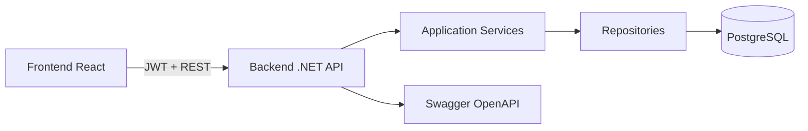
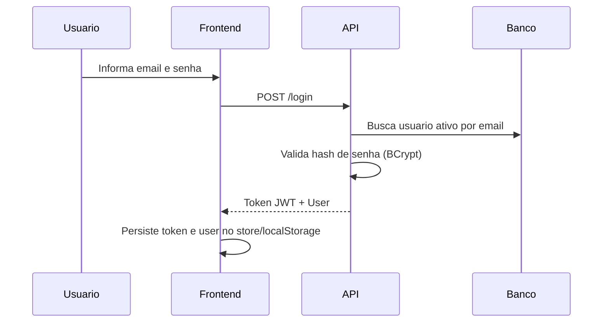
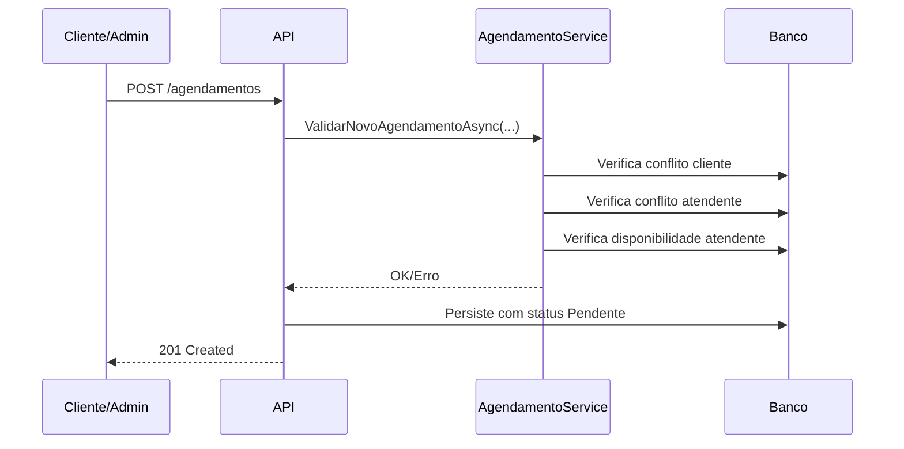
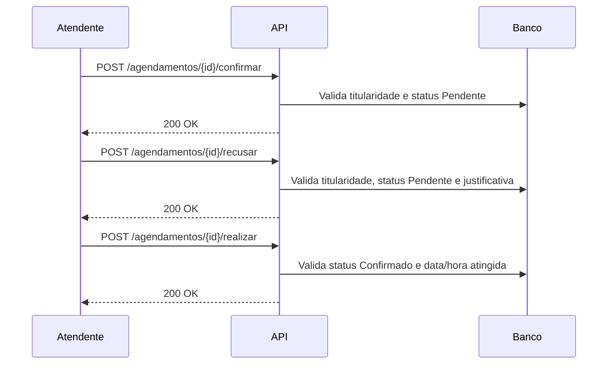

# Documentacao Tecnica - Sistema de Agendamentos

## 1. Visao Geral

Aplicacao web para gestao de usuarios, agendamentos, disponibilidade e relatorios.

- Backend: .NET 8 (Minimal APIs, EF Core, JWT)
- Frontend: React + TypeScript (Vite)
- Banco: PostgreSQL
- Orquestracao: Docker Compose

## 2. Arquitetura de Componentes



## 3. Estrutura de Camadas (Backend)

- Domain: entidades e enums centrais (`Usuario`, `Agendamento`, `Disponibilidade`)
- Application: regras de negocio e interfaces (`UsuarioService`, `AgendamentoService`, `DisponibilidadeService`)
- Infrastructure: persistencia, `AppDbContext`, repositories EF Core
- API: endpoints HTTP, autenticacao/autorizacao JWT, modelos de request/response
- Tests: unitarios e integracao

## 4. Seguranca e Autorizacao

- Autenticacao JWT obrigatoria para endpoints protegidos.
- Claims relevantes no token: `sub`, `nameidentifier`, `email`, `name`, `role`.
- Perfis:
  - `Administrador`/`Admin`
  - `Atendente`
  - `Cliente`/`User`

Politicas:
- `AdminOnly`
- `AtendenteOnly`
- `UserOnly`

## 5. Fluxos-Chave

### 5.1 Login



### 5.2 Criacao de Agendamento



### 5.3 Tratamento de Agendamento por Atendente



## 6. Matriz de Endpoints

### 6.1 Autenticacao

- `POST /login`: autentica usuario persistido e retorna JWT + dados do usuario.
- `GET /admin`: endpoint de verificacao de role admin.
- `GET /user`: endpoint de verificacao de role user/cliente.

### 6.2 Usuarios

- `GET /usuarios`: lista usuarios visiveis por perfil; suporta filtro `tipo`.
- `GET /usuarios/{id}`: admin ou proprio usuario.
- `POST /usuarios`: admin cria usuario com validacoes.
- `PUT /usuarios/{id}`: admin ou proprio usuario (sem alterar email/senha).
- `DELETE /usuarios/{id}`: apenas admin.

### 6.3 Agendamentos

- `POST /agendamentos`: cria agendamento com validacao de conflitos e disponibilidade.
- `GET /agendamentos`: lista por perfil + filtros.
- `GET /agendamentos/{id}`: acesso por perfil e vinculo ao agendamento.
- `PUT /agendamentos/{id}`: admin atualiza agendamento.
- `DELETE /agendamentos/{id}`: admin remove agendamento.
- `POST /agendamentos/{id}/confirmar`: atendente responsavel confirma pendente.
- `POST /agendamentos/{id}/recusar`: atendente responsavel recusa com justificativa.
- `POST /agendamentos/{id}/cancelar`: admin/cliente com regras de status e data.
- `POST /agendamentos/{id}/reagendar`: admin/cliente com justificativa e validacoes.
- `POST /agendamentos/{id}/realizar`: atendente responsavel conclui atendimento confirmado.
- `POST /agendamentos/relatorio`: admin/atendente, com exportacao CSV/XLSX.

### 6.4 Disponibilidade

- `POST /disponibilidades`: admin cadastra disponibilidade.
- `GET /disponibilidades`: admin lista disponibilidades.
- `GET /disponibilidades/{id}`: admin consulta disponibilidade.
- `PUT /disponibilidades/{id}`: admin atualiza disponibilidade.
- `DELETE /disponibilidades/{id}`: admin remove disponibilidade.
- `GET /disponibilidades/horarios-disponiveis`: consulta horarios livres.

## 7. Banco de Dados e Migracoes

- ORM: Entity Framework Core.
- Banco: PostgreSQL.
- Estrutura evoluida por migrations em `backend/Infrastructure/Persistence/Migrations`.

## 8. Executar e Manter

### 8.1 Desenvolvimento local com Docker

```bash
docker compose up -d --build
```

### 8.2 Aplicar migrations manualmente (quando necessario)

```bash
cd backend/API
set ConnectionStrings__DefaultConnection=Host=localhost;Port=5433;Database=agendamentos;Username=postgres;Password=postgres
dotnet ef database update --project ..\Infrastructure\Infrastructure.csproj --startup-project API.csproj
```

### 8.3 Testes

Backend:

```bash
cd backend
dotnet test Tests/Tests.csproj
```

Frontend:

```bash
cd frontend
npm test -- --runInBand
```

## 9. Decisoes de Design

- Clean Architecture para separar regra de negocio de infraestrutura.
- Minimal APIs para simplicidade de composicao dos endpoints.
- JWT stateless para autenticacao de frontend/backend.
- Validacoes de negocio centralizadas em services da camada Application.
- Repositories para desacoplamento entre regras e persistencia.

## 10. Swagger/OpenAPI

- Swagger habilitado em ambiente de desenvolvimento.
- Endpoints criticos possuem `Summary` e `Description` no OpenAPI.
- Esquema de seguranca `Bearer` configurado globalmente no SwaggerGen.
- Uso esperado do header: `Authorization: Bearer <token>`.
